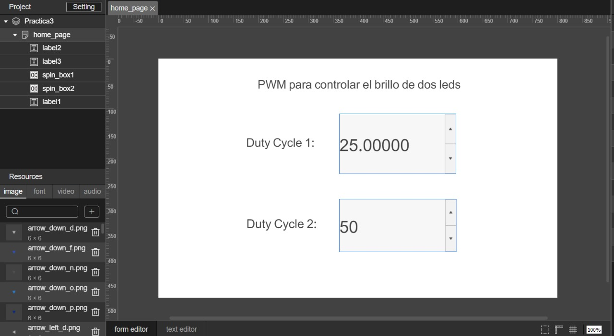

# Práctica 3 - Control de salidas PWM mediante HMI en Controllino

Se presenta el desarrollo completo de la **Práctica 3: Diseño de interfaz gráfica para el control de salidas en Controllino**, cuyo objetivo es controlar el brillo de dos LEDs a través de modulación PWM, utilizando una interfaz HMI (Human-Machine Interface) tipo SpinBox, comunicada vía serial con un Controllino Mega.

---

## 🎯 Objetivo

Diseñar un sistema que permita ajustar la intensidad de brillo de dos LEDs en un Controllino Mega, utilizando una HMI para enviar los valores del *duty cycle* de forma dinámica mediante comunicación serial. El sistema debe permitir:

- Ajuste independiente del brillo de cada LED desde su respectivo SpinBox.
- Encendido/apagado de cada LED mediante un botón físico independiente del valor del SpinBox.
- Desactivación completa del LED si el botón lo apaga, incluso si el SpinBox cambia de valor.

---

## ⚙️ Materiales requeridos

- Controllino Mega + HMI integrada (pantalla STONE).
- Fuente de alimentación del tablero.
- Cables USB tipo A a A, y A a B.
- PC con Arduino IDE.
- Librería oficial de Controllino.
- Software STONE Designer GUI.

---

## 🧩 Contenido del repositorio

---

## 📝 Descripción funcional

- **Comunicación serial (115200 baudios)** entre la pantalla HMI y el Controllino Mega.
- **Lectura de botones físicos** con lógica de antirrebote por software.
- **Mapeo del valor de SpinBox (0–100)** a rango PWM (0–255).
- **Aplicación de PWM** únicamente si el LED está habilitado por su botón físico.
- **Interfaz HMI** con dos SpinBoxes (`spin_box1`, `spin_box2`) y retroalimentación visual del brillo.

---

## 📷 Interfaz gráfica (HMI)

Diseñada en STONE Designer GUI. Cada SpinBox envía su valor correspondiente a través de la interfaz serial al microcontrolador.

---

## 🚀 Cómo usar

1. El código fuente del Controllino se encuentra en el archivo [`P3_LED_PWM.ino`](./P3_LED_PWM.ino), que implementa el control de dos LEDs con PWM mediante una interfaz HMI y botones físicos.
2. Conectar la HMI vía Serial2 al Controllino.
3. Ejecutar el proyecto cargado en la HMI.
4. Usar los botones físicos para activar/desactivar LEDs.
5. Ajustar los valores de los SpinBoxes para modificar el duty cycle (0–100%).

---

## 📎 Enlace del informe IEEE

(Agregar aquí el enlace cuando esté disponible o subirlo al repositorio si es requerido)

---

## 🔗 Créditos

Desarrollado por: [Anthony Dominguez, Sebastian Guazhima]
Curso: [Control Digital]  
Fecha: [22/06/2025]

---

